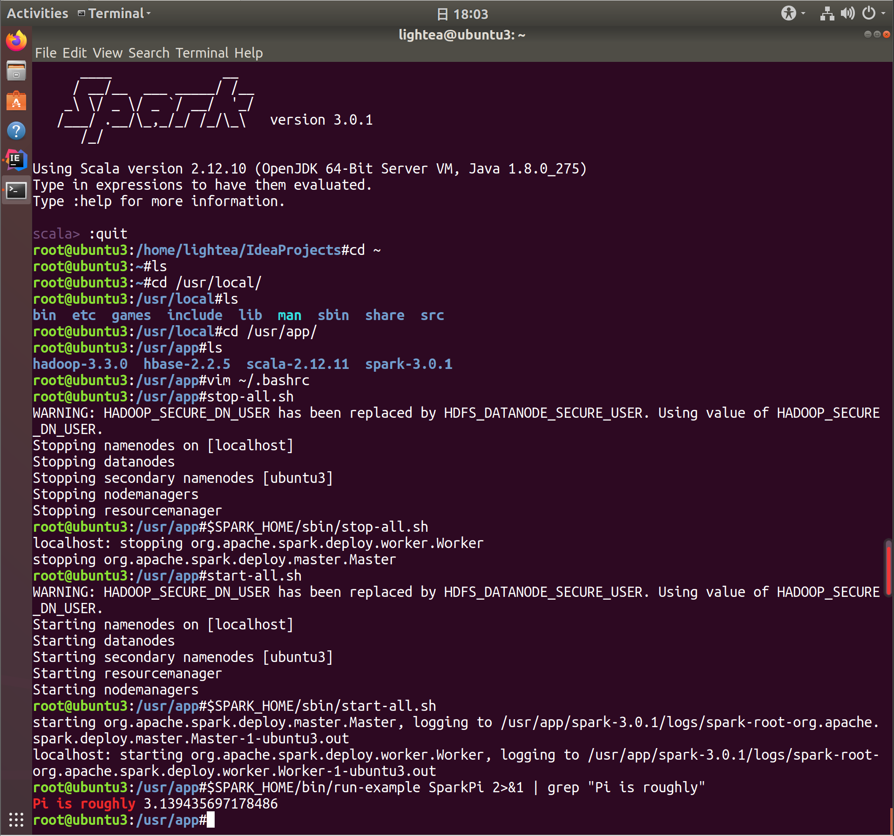

# README

[toc]

## 实验过程

### Spark 安装及环境配置

1. 解压 scala2.12.11, spark3.0.1
``` bash
$ tar -zxvf scala-2.12.11.tgz -C /usr/app
$ tar -zxvf spark-3.0.1-bin-hadoop2.7.tgz -C /usr/app
```

2. 配置环境变量
```bash
# ~/.bashrc 中添加scala, spark的环境变量
## JAVA
export JAVA_HOME=/usr/lib/jvm/java-8-openjdk-amd64
export JRE_HOME=${JAVA_HOME}/jre
export CLASSPATH=.:${JAVA_HOME}/lib:${JRE_HOME}/lib
export PATH=${JAVA_HOME}/bin:$PATH
## HADOOP
export HADOOP_HOME=/usr/app/hadoop-3.3.0
export PATH=$PATH:$HADOOP_HOME/bin:$HADOOP_HOME/sbin
export HADOOP_CONF_DIR=$HADOOP_HOME/etc/hadoop
## SCALA
export SCALA_HOME=/usr/app/scala-2.12.11
export PATH=$PATH:$SCALA_HOME/bin
## SPARK
export SPARK_HOME=/usr/app/spark-3.0.1
export PATH=$PATH:$SPARK_HOME/bin
```
3. 测试安装是否成功
```bash
$ cd $SPARK_HOME
$ start-all.sh	# 启动hadoop,hdfs
$ sbin/start-all.sh	# 启动spark
$ bin/run-example SparkPi 2>&1 | grep "Pi is roughly"
```



### test1

> 统计双十一最热门的商品和最受年轻人(age<30)关注的商家（“添加购物车+购买+添加收藏夹”前100名）

1. [IDEA](https://blog.csdn.net/sunxiaoju/article/details/86516323)中新建sbt项目管理scala代码

2. scala 代码
``` scala
// 1) 统计双十一最热门的商品(不使用dataframe)

// 读取 user_log_format1.csv 文本文件
val data = sc.textFile("hdfs:///e04/data/user_log_format1.csv").flatMap(_.split("\n"))
// 为去除表头(第一行)
val arr = data.take(1)
// 过滤选出日期为1111的数据行，再选择商品ID和动作编号作为(key,value)对，最后过滤掉动作编号为0的情况
val data1 = data.filter(!arr.contains(_)).filter(line=>line.split(",")(5).equals("1111")).map{
      line=>(line.split(",")(1),line.split(",")(6))
      }.mapValues(_.toInt).filter(value=>value._2>0)
// 计数每个key的rdd数量，再按value从大到小排序，取前100个
val data2 = data1.countByKey().toSeq.sortWith(_._2>_._2).take(100)
// 再次转化为rdd后保存到本地文本文件
sc.parallelize(data2).saveAsTextFile("hdfs:///e04/output1-1")
```

3. 运行结果

.png)

.png)

.png)

.png)

