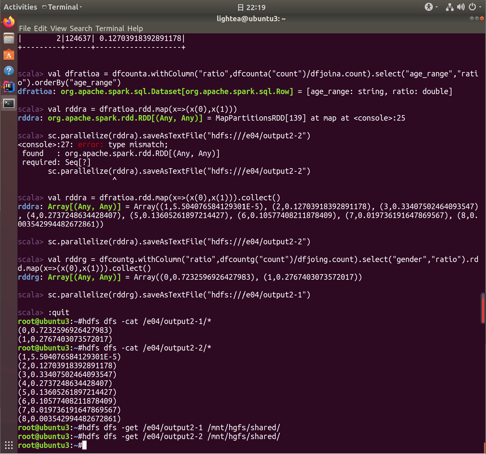

# README

[toc]

## 实验过程

### Spark 安装及环境配置

1. 解压 scala2.12.11, spark3.0.1
``` bash
$ tar -zxvf scala-2.12.11.tgz -C /usr/app
$ tar -zxvf spark-3.0.1-bin-hadoop2.7.tgz -C /usr/app
```

2. 配置环境变量
```bash
# ~/.bashrc 中添加scala, spark的环境变量
## JAVA
export JAVA_HOME=/usr/lib/jvm/java-8-openjdk-amd64
export JRE_HOME=${JAVA_HOME}/jre
export CLASSPATH=.:${JAVA_HOME}/lib:${JRE_HOME}/lib
export PATH=${JAVA_HOME}/bin:$PATH
## HADOOP
export HADOOP_HOME=/usr/app/hadoop-3.3.0
export PATH=$PATH:$HADOOP_HOME/bin:$HADOOP_HOME/sbin
export HADOOP_CONF_DIR=$HADOOP_HOME/etc/hadoop
## SCALA
export SCALA_HOME=/usr/app/scala-2.12.11
export PATH=$PATH:$SCALA_HOME/bin
## SPARK
export SPARK_HOME=/usr/app/spark-3.0.1
export PATH=$PATH:$SPARK_HOME/bin
```
3. 测试安装是否成功
```bash
$ cd $SPARK_HOME
$ start-all.sh	# 启动hadoop,hdfs
$ sbin/start-all.sh	# 启动spark
$ bin/run-example SparkPi 2>&1 | grep "Pi is roughly"
```


### test1

> 统计双十一最热门的商品和最受年轻人(age<30)关注的商家（“添加购物车+购买+添加收藏夹”前100名）

1. [IDEA](https://blog.csdn.net/sunxiaoju/article/details/86516323)中新建sbt项目管理scala代码
build.sbt 文件内容

```sbt
name := "ShoppingScala"

version := "0.1"

scalaVersion := "2.12.11"

idePackagePrefix := Some("zky.nju.edu.cn")

libraryDependencies += "org.apache.spark" %% "spark-core" % "3.0.1"
```


2. scala 代码
``` scala
// 1) 统计双十一最热门的商品(不使用dataframe)

// 读取 user_log_format1.csv 文本文件
val data = sc.textFile("hdfs:///e04/data/user_log_format1.csv").flatMap(_.split("\n"))
// 为去除表头(第一行)
val arr = data.take(1)
// 过滤选出日期为1111的数据行，再选择商品ID和动作编号作为(key,value)对，最后过滤掉动作编号为0的情况
val data1 = data.filter(!arr.contains(_)).filter(line=>line.split(",")(5).equals("1111")).map{
      line=>(line.split(",")(1),line.split(",")(6))
      }.mapValues(_.toInt).filter(value=>value._2>0)
// 计数每个key的rdd数量，再按value从大到小排序，取前100个
val data2 = data1.countByKey().toSeq.sortWith(_._2>_._2).take(100)
// 再次转化为rdd后保存到本地文本文件
sc.parallelize(data2).saveAsTextFile("hdfs:///e04/output1-1")
```

```scala
// 2) 统计双十一最受年轻人(age<30)关注的商家(使用dataframe)
/*
1. info 筛出age_range<4的user_id 
2. time_stamp="1111", action_type!=0的数据条，
3. 用join筛选出1.中的user_id
4. countByKey 或者 groupBy("merchant_id").count()
5. 排序，取前100个
*/
val dflog = spark.read.format("csv").option("header","true").load("hdfs:///e04/data/user_log_format1.csv")
val dfinfo = spark.read.format("csv").option("header","true").load("hdfs:///e04/data/user_info_format1.csv")
val dfia = dfinfo.filter("age_range<4 and age_range>0").select("user_id","age_range")
val dfla = dflog.filter("time_stamp=1111 and action_type!=0").select("user_id","seller_id","action_type")
val dfjoin = dfia.join(dfla,"user_id")
val dfss = dfjoin.groupBy("seller_id").count()
val rddss = dfss.orderBy(dfss("count").desc).rdd.map(x=>(x(0),x(1))).take(100)
sc.parallelize(rddss).saveAsTextFile("hdfs:///e04/output1-2")
```

3. 运行结果

1-1

.png)

1-1 result

.png)

.png)

.png)

1-2

.png)

.png)

.png)

1-2 result

.png)

.png)

.png)

### test2

> 编写Spark程序统计双十一购买了了商品的男女女比例，以及购买了商品的买家年年龄段的比例；

1. 解决步骤

```
//2-1 双十一购买了商品的男女比例
/*TODO
1. 读入两张表
2. log 挑出user_id, time_stamp, action_type; 筛选出action_type=2,time_stamp=1111, 
3. info 挑出user_id, gender; 筛选出gender=0/1
4. join by user_id
5. groupBy("gender").count()
6. ratio 计算
*/
```
```
//2-2 统计双十一购买了商品的商家年龄段的比例
/*TODO
1. info 挑出user_id, age_range; 筛选出 0<age_range<9
2. log 挑出user_id, time_stamp, action_type; 筛选出 time_stamp=1111 and action_type=2
3. join by user_id
4. groupBy("age_range").count()
5. ratio 计算
*/
```
2. scala 代码
```scala
//2-1 双十一购买了商品的男女比例
val dflog =spark.read.format("csv").option("header","true").load("hdfs:///e04/data/user_log_format1.csv")
val dfinfo =spark.read.format("csv").option("header","true").load("hdfs:///e04/data/user_info_format1.csv")
val dflg = dflog.select("user_id","time_stamp","action_type").filter("time_stamp=1111 and action_type=2")
val dfig = dfinfo.select("user_id","gender").filter("gender=1 or gender=0")
val dfjoing = dfig.join(dflg,"user_id")
val dfcountg = dfjoing.groupBy("gender").count()
dfcountg.withColumn("ratio",dfcountg("count")/dfjoing.count).show
```
```
+------+------+------------------+                                              
|gender| count|             ratio|
+------+------+------------------+
|     0|846054|0.7232596926427983|
|     1|323725|0.2767403073572017|
+------+------+------------------+

```

```scala
//2-2 统计双十一购买了商品的商家年龄段的比例
val dfia = dfinfo.select("user_id","age_range").filter("age_range>0 and age_range<9")
val dfla = dflog.select("user_id","time_stamp","action_type").filter("time_stamp=1111 and action_type=2")
val dfjoina = dfia.join(dfla,"user_id")
val dfcounta = dfjoina.groupBy("age_range").count()
dfcounta.withColumn("ratio",dfcounta("count")/dfjoina.count).show
```
```
+---------+------+--------------------+                                         
|age_range| count|               ratio|
+---------+------+--------------------+
|        7| 19363|0.019736191647869567|
|        3|327758| 0.33407502464093547|
|        8|  3476|0.003542994482672861|
|        5|133480| 0.13605261897214427|
|        6|103774| 0.10577408211878409|
|        1|    54|5.504076584129301E-5|
|        4|268549|  0.2737248634428407|
|        2|124637| 0.12703918392891178|
+---------+------+--------------------+

```
```scala
/*将答案保存到本地*/
val rddrg = dfcountg.withColumn("ratio",dfcountg("count")/dfjoing.count).select("gender","ratio").rdd.map(x=>(x(0),x(1))).collect()
sc.parallelize(rddrg).saveAsTextFile("hdfs:///e04/output2-1")

val dfratioa = dfcounta.withColumn("ratio",dfcounta("count")/dfjoina.count).select("age_range","ratio").orderBy("age_range")
val rddra = dfratioa.rdd.map(x=>(x(0),x(1)))
val rddra = dfratioa.rdd.map(x=>(x(0),x(1))).collect()
sc.parallelize(rddra).saveAsTextFile("hdfs:///e04/output2-2")
```
3. 运行结果
    2-1

  .png)

  .png)

  2-2

  .png)

  SparkUI

  .png)

  all result (save as text files)

### test3

1. sql 代码
```scala
	// 以 dataframe 读入两个 csv 文件
val dflog =spark.read.format("csv").option("header","true").load("hdfs:///e04/data/user_log_format1.csv")
val dfinfo =spark.read.format("csv").option("header","true").load("hdfs:///e04/data/user_info_format1.csv")
	// 转换成sql可用的表格类型
dflog.createOrReplaceTempView("Tlog")
dfinfo.createOrReplaceTempView("Tinfo")
	// sql 语句
val dfrg = spark.sql("select gender, count(*) as num from (select distinct a.user_id, gender from Tlog a, Tinfo b where a.user_id=b.user_id and a.action_type=2 and gender in ('0','1')) group by gender")
val dfra = spark.sql("select age_range, count(*) as num from (select distinct a.user_id, age_range from Tlog a, Tinfo b where a.user_id=b.user_id and a.action_type=2 and age_range in(1,2,3,4,5,6,7,8)) group by age_range order by age_range")
```

```
dfrg.show
+------+------+                                                                 
|gender|   num|
+------+------+
|     0|285638|
|     1|121670|
+------+------+
dfra.show
+---------+------+                                                              
|age_range|   num|
+---------+------+
|        1|    24|
|        2| 52871|
|        3|111654|
|        4| 79991|
|        5| 40777|
|        6| 35464|
|        7|  6992|
|        8|  1266|
+---------+------+
```

``` scala
/*添加一列ratio计算*/
dfrg.agg("num"->"sum").show
+--------+                                                                      
|sum(num)|
+--------+
|  407308|
+--------+
dfrg.withColumn("ratio",dfrg("num")/407308).show
+------+------+------------------+                                              
|gender|   num|             ratio|
+------+------+------------------+
|     0|285638|0.7012825674919225|
|     1|121670|0.2987174325080774|
+------+------+------------------+
dfra.agg("num"->"sum").show
+--------+                                                                      
|sum(num)|
+--------+
|  329039|
+--------+
dfra.withColumn("ratio",dfra("num")/329039).show
+---------+------+--------------------+                                         
|age_range|   num|               ratio|
+---------+------+--------------------+
|        1|    24|7.293968192220375E-5|
|        2| 52871| 0.16068308012120144|
|        3|111654|  0.3393336352225724|
|        4| 79991| 0.24310492069329168|
|        5| 40777|  0.1239275587392376|
|        6| 35464| 0.10778053665370975|
|        7|  6992|0.021249760666668692|
|        8|  1266|0.003847568221396...|
+---------+------+--------------------+
```

2. 运行结果

.png)

.png)

.png)